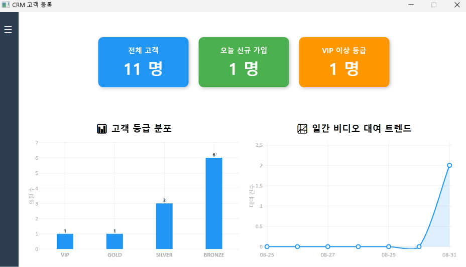
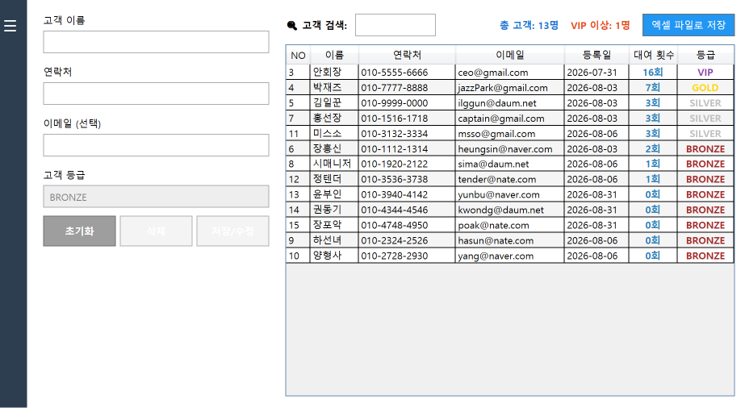
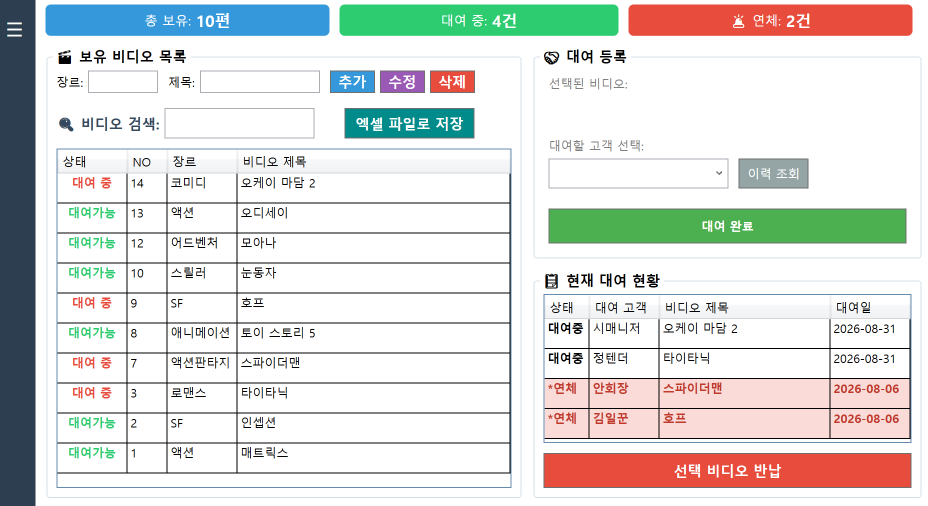

# WpfApp1

간단한 WPF MVVM 데모: 고객·비디오·대여 모델 샘플 프로젝트.

## 주요 정보
- 플랫폼: Windows (WPF)
- 타겟 프레임워크: .NET 10
- 패턴: MVVM (Models / ViewModels / Views)

## 실행 예시 (스크린샷)

**대시보드 — 요약**

**고객 — 목록/편집**

**비디오·대여 — 목록/대여**

## 기능
- 고객 목록 및 간단 데이터 모델
- 비디오 및 대여 모델 예시
- MVVM 기반 바인딩과 커맨드(RelayCommand)

## 요구사항
- Windows
- .NET 10 SDK
- Visual Studio 2022 이상 또는 Visual Studio 2026 권장

## 빠른 시작

Visual Studio
1. 솔루션 폴더(C:\...\WpfApp1)를 엽니다.
2. `WpfApp1.slnx`를 엽니다.
3. 시작 프로젝트가 `WpfApp1`인지 확인하고 F5로 실행합니다.

명령행
1. 저장소 루트로 이동
   dotnet restore
2. 빌드
   dotnet build
3. 실행 (Windows 환경)
   dotnet run --project WpfApp1.csproj

## 프로젝트 구조
- App.xaml / App.xaml.cs: 애플리케이션 진입점
- Views/: 뷰(예: MainWindow.xaml)
- ViewModels/: 뷰 모델(예: CustomerViewModel.cs, VideoViewModel.cs)
- Models/: 데이터 모델(예: CustomerModel.cs, VideoModel.cs, RentalModel.cs)
- Base/: 공통 유틸(예: RelayCommand, ViewModelBase)

## 기여
1. Issue를 생성하여 변경 이유를 설명하세요.
2. 기능 추가/수정은 새 브랜치 생성(`feature/이름`).
3. PR에는 변경 요약, 영향 범위, 테스트 방법을 기입하세요.
4. 코드 스타일을 준수하고 가능한 단위 테스트를 추가하세요.

## 라이선스
이 프로젝트는 MIT 라이선스를 따릅니다.

## 연락/문의
문제나 개선 제안은 Issue로 남겨 주세요.
